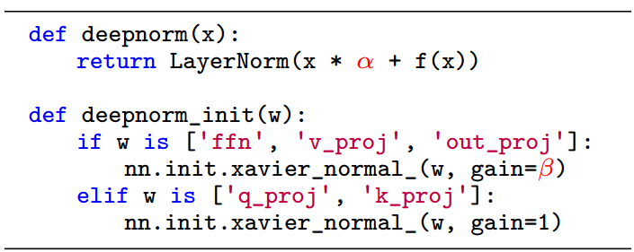

# 2.layer\_normalization

### 1.**Normalization**

#### 1.1 **Batch Norm**

**为什么要进行BN呢？**

1. 在深度神经网络训练的过程中，通常以输入网络的每一个mini-batch进行训练，这样每个batch具有不同的分布，使模型训练起来特别困难。
2. Internal Covariate Shift (ICS) 问题：在训练的过程中，激活函数会改变各层数据的分布，随着网络的加深，这种改变（差异）会越来越大，使模型训练起来特别困难，收敛速度很慢，会出现梯度消失的问题。

**BN的主要思想：** 针对每个神经元，**使数据在进入激活函数之前，沿着通道计算每个batch的均值、方差，‘强迫’数据保持均值为0，方差为1的正态分布，** 避免发生梯度消失。具体来说，就是把第1个样本的第1个通道，加上第2个样本第1个通道 ...... 加上第 N 个样本第1个通道，求平均，得到通道 1 的均值（注意是除以 N×H×W 而不是单纯除以 N，最后得到的是一个代表这个 batch 第1个通道平均值的数字，而不是一个 H×W 的矩阵）。求通道 1 的方差也是同理。对所有通道都施加一遍这个操作，就得到了所有通道的均值和方差。

**BN的使用位置：** 全连接层或卷积操作之后，激活函数之前。

**BN算法过程：**

- 沿着通道计算每个batch的均值
- 沿着通道计算每个batch的方差
- 做归一化
- 加入缩放和平移变量$\gamma$和 $\beta$

**加入缩放和平移变量的原因是：****保证每一次数据经过归一化后还保留原有学习来的特征，同时又能完成归一化操作，加速训练****。** 这两个参数是用来学习的参数。

**BN的作用：**

1. 允许较大的学习率；
2. 减弱对初始化的强依赖性
3. 保持隐藏层中数值的均值、方差不变，让数值更稳定，为后面网络提供坚实的基础；
4. 有轻微的正则化作用（相当于给隐藏层加入噪声，类似Dropout）

**BN存在的问题：**

1. 每次是在一个batch上计算均值、方差，如果batch size太小，则计算的均值、方差不足以代表整个数据分布。
2. **batch size太大：** 会超过内存容量；需要跑更多的epoch，导致总训练时间变长；会直接固定梯度下降的方向，导致很难更新。

#### 1.2 Layer Norm

LayerNorm是大模型也是transformer结构中最常用的归一化操作，简而言之，它的作用是 **对特征张量按照某一维度或某几个维度进行0均值，1方差的归一化** 操作，计算公式为：

$$
\mathrm{y}=\frac{\mathrm{x}-\mathrm{E}(\mathrm{x})}{\sqrt{\mathrm{V} \operatorname{ar}(\mathrm{x})+\epsilon}} * \gamma+\beta
$$

这里的 $x$ 可以理解为\*\* 张量中具体某一维度的所有元素\*\*，比如对于 shape 为 (2,2,4) 的张量 input，若指定归一化的操作为第三个维度，则会对第三个维度中的四个张量（2,2,1），各进行上述的一次计算.

详细形式：

$$
a_{i}=\sum_{j=1}^{m} w_{i j} x_{j}, \quad y_{i}=f\left(a_{i}+b_{i}\right)
$$

$$
\bar{a}_{i}=\frac{a_{i}-\mu}{\sigma} g_{i}, \quad y_{i}=f\left(\bar{a}_{i}+b_{i}\right),
$$

$$
\mu=\frac{1}{n} \sum_{i=1}^{n} a_{i}, \quad \sigma=\sqrt{\frac{1}{n} \sum_{i=1}^{n}\left(a_{i}-\mu\right)^{2}}.
$$

这里结合PyTorch的nn.LayerNorm算子来看比较明白：

```python
nn.LayerNorm(normalized_shape, eps=1e-05, elementwise_affine=True, device=None, dtype=None)

```

- `normalized_shape`：归一化的维度，int（最后一维）list（list里面的维度），还是以（2,2,4）为例，如果输入是int，则必须是4，如果是list，则可以是\[4], \[2,4], \[2,2,4]，即最后一维，倒数两维，和所有维度
- `eps`：加在分母方差上的偏置项，防止分母为0
- `elementwise_affine`：是否使用可学习的参数 $\gamma$ 和 $\beta$ ，前者开始为1，后者为0，设置该变量为True，则二者均可学习随着训练过程而变化

Layer Normalization (LN) 的一个优势是不需要批训练，在单条数据内部就能归一化。LN不依赖于batch size和输入sequence的长度，因此可以用于batch size为1和RNN中。**LN用于RNN效果比较明显，但是在CNN上，效果不如BN**。

#### 1.3 Instance Norm

IN针对图像像素做normalization，最初用于图像的风格化迁移。在图像风格化中，生成结果主要依赖于某个图像实例，feature map 的各个 channel 的均值和方差会影响到最终生成图像的风格。所以对整个batch归一化不适合图像风格化中，因而对H、W做归一化。可以加速模型收敛，并且保持每个图像实例之间的独立。

对于，IN 对每个样本的 H、W 维度的数据求均值和标准差，保留 N 、C 维度，也就是说，它只在 channel 内部求均值和标准差，其公式如下：

$$
y_{t i j k}=\frac{x_{t i j k}-\mu_{t i}}{\sqrt{\sigma_{t i}^{2}+\epsilon}} \quad \mu_{t i}=\frac{1}{H W} \sum_{l=1}^{W} \sum_{m=1}^{H} x_{t i l m} \quad \sigma_{t i}^{2}=\frac{1}{H W} \sum_{l=1}^{W} \sum_{m=1}^{H}\left(x_{t i l m}-m u_{t i}\right)^{2}
$$

#### 1.5 **Group Norm**

**GN是为了解决BN对较小的mini-batch size效果差的问题****。** ​

GN适用于占用显存比较大的任务，例如图像分割。对这类任务，可能 batch size 只能是个位数，再大显存就不够用了。而当 batch size 是个位数时，BN 的表现很差，因为没办法通过几个样本的数据量，来近似总体的均值和标准差。GN 也是独立于 batch 的，它是 LN 和 IN 的折中。

**具体方法：** GN 计算均值和标准差时，把每一个样本 feature map 的 channel 分成 G 组，每组将有 C/G 个 channel，然后将这些 channel 中的元素求均值和标准差。各组 channel 用其对应的归一化参数独立地归一化。

$$
\mu_{n g}(x)=\frac{1}{(C / G) H W} \sum_{c=g C / G}^{(g+1) C / G} \sum_{h=1}^{H} \sum_{w=1}^{W} x_{n c h w}
$$

$$
\sigma_{n g}(x)=\sqrt{\frac{1}{(C / G) H W} \sum_{c=g C / G}^{(g+1) C / G} \sum_{h=1}^{H} \sum_{w=1}^{W}\left(x_{n c h w}-\mu_{n g}(x)\right)^{2}+\epsilon}
$$

#### 1.6 RMS Norm

与layerNorm相比，RMS Norm的主要区别在于**去掉了减去均值的部分**，计算公式为：

$$
\bar{a}_{i}=\frac{a_{i}}{\operatorname{RMS}(\mathbf{a})} g_{i}, \quad where~ \operatorname{RMS}(\mathbf{a})=\sqrt{\frac{1}{n} \sum_{i=1}^{n} a_{i}^{2}}.
$$

RMS中去除了`mean`的统计值的使用，只使用`root mean square(RMS)`进行归一化。

#### 1.4 pRMSNorm介绍

RMS具有线性特征，所以提出可以用部分数据的RMSNorm来代替全部的计算，pRMSNorm表示使用前p%的数据计算RMS值。k=n\*p表示用于RMS计算的元素个数。实测中，使用6.25%的数据量可以收敛

$$
\overline{\operatorname{RMS}}(\mathbf{a})=\sqrt{\frac{1}{k} \sum_{i=1}^{k} a_{i}^{2}}
$$

#### 1.7 Deep Norm

Deep Norm是对Post-LN的的改进，具体的：



- DeepNorm在进行Layer Norm之前会以 $\alpha$ 参数扩大残差连接
- 在Xavier参数初始化过程中以 $\beta$ 减小部分参数的初始化范围

一些模型的具体参数使用方法如下：


论文中，作者认为 Post-LN 的不稳定性部分来自于**梯度消失**以及**太大的模型更新**，同时，有以下几个理论分析

- 定义了“预期模型更新”的概念表示 模型更新的规模量级
- 证明了 $W^Q$和 $W^K$不会改变注意力输出大小数量级的界限，因而 $\beta$ 并没有缩小这部分参数
- 模型倾向于**累积每个子层的更新**，从而**导致模型更新量呈爆炸式增长**，从而使早期优化变得不稳定
- 使用Deep Norm 的 "预期模型更新"，在参数 $\alpha, \beta$ 取值适当的时候，以**常数为界**

同时，作者通过实验证实了Deep Norm在训练深层transformer模型的时候具备近乎恒定的更新规模，成功训练了1000层transformer的模型，认为Deep Norm在**具备 Post-LN 的良好性能 的同时又有 Pre-LN 的稳定训练**

代码实现：[microsoft/torchscale: Foundation Architecture for (M)LLMs](https://github.com/microsoft/torchscale "microsoft/torchscale: Foundation Architecture for (M)LLMs")

### 2. BN & LN & IN & GN

常用的Normalization方法主要有：

- Batch Normalization（BN，2015年）、
- Layer Normalization（LN，2016年）、
- Instance Normalization（IN，2017年）、
- Group Normalization（GN，2018年）。

它们都是从激活函数的输入来考虑、做文章的，以不同的方式**对激活函数的输入进行 Norm** 的。

将输入的 **feature map shape** 记为\*\*`[N, C, H, W]`\*\*，其中N表示batch size，即N个样本；C表示通道数；H、W分别表示特征图的高度、宽度。这几个方法主要的区别就是在：

1. BN是在batch上，对N、H、W做归一化，而保留通道 C 的维度。**BN对较小的batch size效果不好。BN适用于固定深度的前向神经网络**，如CNN，不适用于RNN；
2. LN在通道方向上，对C、H、W归一化，主要对RNN效果明显；
3. IN在图像像素上，对H、W做归一化，用在风格化迁移；
4. GN将channel分组，然后再做归一化。


**比喻成一摞书，这摞书总共有 N 本，每本有 C 页，每页有 H 行，每行 有W 个字符。**

1. BN 求均值时，相当于把这些书按页码一一对应地加起来（例如第1本书第36页，第2本书第36页......），再除以每个页码下的字符总数：N×H×W，因此可以把 BN 看成求“平均书”的操作（注意这个“平均书”每页只有一个字），求标准差时也是同理。
2. LN 求均值时，相当于把每一本书的所有字加起来，再除以这本书的字符总数：C×H×W，即求整本书的“平均字”，求标准差时也是同理。
3. IN 求均值时，相当于把一页书中所有字加起来，再除以该页的总字数：H×W，即求每页书的“平均字”，求标准差时也是同理。
4. GN 相当于把一本 C 页的书平均分成 G 份，每份成为有 C/G 页的小册子，求每个小册子的“平均字”和字的“标准差”。

### 3.Post-LN 和 Pre-LN


左边是原版Transformer的Post-LN，即将LN放在addition之后；右边是改进之后的Pre-LN，即把LN放在FFN和MHA之前。

一般认为，Post-Norm在残差之后做归一化，对参数正则化的效果更强，进而模型的收敛性也会更好；而Pre-Norm有一部分参数直接加在了后面，没有对这部分参数进行正则化，可以在反向时防止梯度爆炸或者梯度消失，大模型的训练难度大，因而使用Pre-Norm较多。

目前比较明确的结论是：**同一设置之下，Pre Norm结构往往更容易训练，但最终效果通常不如Post Norm**。Pre Norm更容易训练好理解，因为它的恒等路径更突出，但为什么它效果反而没那么好呢？[为什么Pre Norm的效果不如Post Norm？ ](https://kexue.fm/archives/9009 "为什么Pre Norm的效果不如Post Norm？ ")


参考资料：

- [Batch Normalization](https://arxiv.org/pdf/1502.03167.pdf "Batch Normalization")
- [Layer Normalization](https://arxiv.org/abs/1607.06450 "Layer Normalization")
- [Instance Normalization](https://arxiv.org/pdf/1607.08022.pdf "Instance Normalization")
- [Group Normalization](https://arxiv.org/pdf/1803.08494.pdf "Group Normalization")
- [Root Mean Square Layer Normalization](https://arxiv.org/abs/1910.07467 "Root Mean Square Layer Normalization")
- [Group Normalization](https://arxiv.org/abs/1803.08494 "Group Normalization")
- [Deep Normalization](https://link.zhihu.com/?target=https://arxiv.org/pdf/2203.00555.pdf "Deep Normalization")
- [A Survey of Large Language Models](https://arxiv.org/abs/2303.18223 "A Survey of Large Language Models")
