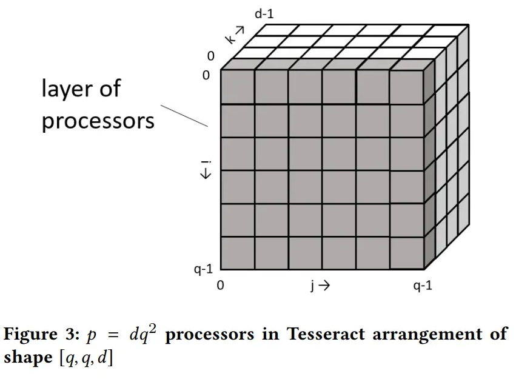

# 分布式训练题目

### 1. 理论篇

#### 1.1 训练 大语言模型 存在问题？

1.  **计算资源需求**\*\*：\*\* 训练大型语言模型需要大量的计算资源，包括高端 GPU、大量的内存和高速存储器。这可能限制了许多研究人员和组织的训练能力，因为这些资源通常很昂贵。
2.  **数据需求**\*\*：\*\* 训练大型语言模型需要大规模的数据集，这些数据集通常需要大量的标注和清洗工作。获取高质量的数据可能是一项困难和昂贵的任务。
3.  **长时间训练**\*\*：\*\* 训练大型语言模型需要大量的时间。特别是对于巨型模型，训练可能需要数周甚至数月的时间，这增加了实验的时间和成本。
4.  **环境影响**\*\*：\*\* 大规模模型的训练需要大量的能源和计算资源，可能对环境造成影响。这引发了对训练模型的可持续性和能源效率的关注。
5.  **过拟合和泛化**\*\*：\*\* 训练大型模型可能导致过拟合问题，特别是当训练数据集不能充分覆盖所有可能的语言情况和使用场景时。此外，对于大型模型，泛化能力可能会受到一定程度的影响。
6.  **认知偏差和歧视性**\*\*：\*\* 如果训练数据集存在偏差或歧视性，大型语言模型可能会继承这些问题，并在生成文本时表现出类似的偏见。

#### 1.2 什么是 点对点通信？

点对点通信（Peer-to-Peer Communication）是一种网络通信模式，其中**两个或多个计算机或设备之间直接进行通信，而不需要通过中央服务器或集中式系统**。在点对点通信中，每个参与者都可以充当客户端和服务器，能够直接与其他节点通信、交换信息或共享资源。

这种通信模式与传统的客户端-服务器模型不同，后者在网络中有一个中心服务器负责处理和转发所有请求和数据。而点对点通信模式中，参与者之间能够直接建立连接，相互传输信息或资源，使得网络更为分散和去中心化。

#### 1.3 什么是 集体通信？

集体通信（Collective Communication）是指**一组计算节点或处理单元之间进行协作、交换信息或执行通信操作的过程**。这种通信形式**涉及到多个节点之间的集体参与，而不仅仅是点对点的通信**。它可以用于并行计算、分布式系统和群集计算等领域，以便在多个节点之间协调和管理数据的传输、处理和同步操作。

集体通信常见的操作包括广播、散射、汇总、规约和全局同步等。

#### 1.4 什么是 数据并行？

所谓数据并行，就是由于训练数据集太大；因此，**将数据集分为N份，每一份分别装载到N个GPU节点中，同时，每个GPU节点持有一个完整的模型副本**，分别基于每个GPU中的数据去进行梯度求导。然后，在GPU0上对每个GPU中的梯度进行累加，最后，再将GPU0聚合后的结果广播到其他GPU节点。

#### 1.5 数据并行 如何 提升效率？

数据并行是在多个处理单元上同时处理数据的策略，它可以通过一些方法来提高效率：

1.  **增加处理单元数量**\*\*：\*\* 增加处理单元（如 GPU 或 CPU）的数量可以加速数据并行计算，因为更多的处理单元可以同时处理更多的数据子集。
2.  **批处理训练**\*\*：\*\* 使用批处理训练可以提高数据并行的效率。通过合并多个数据子集形成批次，可以减少通信和同步开销，同时更好地利用处理单元的并行计算能力。
3.  **异步更新**\*\*：\*\* 对于参数更新，可以采用异步更新的策略。不同的处理单元可以在计算完成后立即更新自己的参数，而不必等待其他处理单元完成计算。虽然这可能会导致一定程度的参数不一致，但可以提高整体的训练速度。
4.  **模型和数据并行结合**\*\*：\*\* 在一些情况下，可以结合使用模型并行和数据并行来提高效率。将模型分布到多个处理单元上，同时每个处理单元处理不同的数据子集，可以有效地利用多个处理单元的计算能力。
5.  **减少通信开销**\*\*：\*\* 优化通信机制可以降低处理单元之间的通信开销。采用高效的通信协议或减少同步频率等方法可以提高数据并行的效率。
6.  **负载均衡**\*\*：\*\* 确保数据在不同处理单元间的分配是均衡的，避免某些处理单元负载过重或过轻，以充分利用所有的计算资源。

#### 1.6 什么是 流水线并行？

所谓流水线并行，就是由于模型太大，无法将整个模型放置到单张GPU卡中；因此，将**模型的不同层放置到不同的计算设备**，降低单个计算设备的显存消耗，从而实现超大规模模型训练。
如下图所示，模型共包含四个模型层（如：Transformer层），被切分为三个部分，分别放置到三个不同的计算设备。即第 1 层放置到设备 0，第 2 层和第三 3 层放置到设备 1，第 4 层放置到设备 2。

#### 1.7 什么是 张量并行 (intra-layer)？

和流水线并行类似，张量并行也是将模型分解放置到不同的GPU上，以解决单块GPU无法储存整个模型的问题。和流水线并行不同的地方在于，**张量并行是针对模型中的张量进行拆分，将其放置到不同的GPU上**。

模型并行是不同设备负责单个计算图不同部分的计算。而将计算图中的层内的参数（张量）切分到不同设备（即层内并行），每个设备只拥有模型的一部分，以减少内存负荷，我们称之为张量模型并行。

#### 1.8 数据并行 vs 张量并行 vs 流水线并行?

数据并行、张量并行和流水线并行是在并行计算中常见的三种策略，它们有不同的应用场景和优势：

1、**数据并行（Data Parallelism）：**

-   **概念：** 数据并行是指将整个模型复制到每个处理单元上，不同处理单元处理不同的数据子集。每个处理单元独立计算，并通过同步更新模型参数来实现训练。
-   **适用场景：** 数据并行适用于大型模型和数据集，特别是在深度学习中。每个处理单元负责计算不同数据子集上的梯度，然后同步更新模型参数。
-   **优势：** 易于实现，适用于大规模数据和模型。

2、**张量并行（Tensor Parallelism）：**

-   **概念：** 张量并行是指将模型分解成多个部分，每个部分在不同处理单元上进行计算。通常，这涉及到在层与层之间划分模型，并在不同的 GPU 或处理单元上执行这些部分。
-   **适用场景：** 张量并行适用于非常大的模型，其中单个 GPU 的内存容量无法容纳整个模型。它允许将模型的不同部分分配到不同的处理单元上，从而扩展模型的规模。
-   **优势：** 适用于大型模型的规模扩展，可用于解决内存限制问题。

3、**流水线并行（Pipeline Parallelism）：**

-   **概念：** 流水线并行是指将模型的不同层分配到不同的处理单元上，并通过将不同层的输出传递给下一层来实现计算。每个处理单元负责一个模型层的计算。
-   **适用场景：** 流水线并行适用于深层次的模型，其中各层之间的计算相对独立。它可以提高模型的整体计算速度，特别是在层之间存在较大的计算延迟时。
-   **优势：** 适用于深层次模型，减少整体计算时间。

这三种并行策略通常可以结合使用，具体取决于应用的场景和问题的性质。在深度学习等领域，常常会使用数据并行和张量并行相结合的方式，以提高模型的训练速度和规模。

#### 1.9 什么是 3D并行？

3D并行，或者混合并行 (Hybrid Parallelism)，则是将以上三种策略结合起来使用，达到同时提升存储和计算效率的目的。Megatron-Turing NLG 就是先将 Transformer block 使用流水线和张量 2D 并行，然后再加上数据并行，将训练扩展到更多的GPU。

#### 1.10 想要训练1个LLM，如果只想用1张显卡，那么对显卡的要求是什么？

显卡显存足够大，nB模型微调一般最好准备20nGB以上的显存。

1.  **显存大小**\*\*：\*\* 大型语言模型需要大量的显存来存储模型参数和中间计算结果。通常，至少需要 16GB 或更多的显存来容纳这样的模型。对于较小的模型，8GB 的显存也可能足够。
2.  **计算能力**\*\*：\*\* 针对大型神经网络模型，较高的计算能力通常可以加快训练速度。通常情况下，NVIDIA 的 RTX 系列或者 A系列的显卡具有较高的性能和计算能力，例如 RTX 2080 Ti、RTX 3080、RTX 3090 等。这些显卡提供了更多的 CUDA 核心和更高的计算能力，能够更快地处理大型模型。
3.  **带宽和速度**\*\*：\*\* 显卡的显存带宽和速度也是一个考虑因素。较高的内存带宽可以更快地从内存读取数据，对于大型模型的训练非常重要。
4.  **兼容性和优化**\*\*：\*\* 良好的软硬件兼容性以及针对深度学习训练任务的优化也是考虑的因素。确保显卡与所选深度学习框架兼容，并且可以利用框架提供的优化功能。

#### 1.11 如果有N张显存足够大的显卡，怎么加速训练？

1.  **数据并行化**\*\*：\*\* 在数据并行化中，模型的多个副本在不同的 GPU 上训练相同的数据批次。每个 GPU 计算梯度，并将结果汇总到主 GPU 或进行参数更新。这种方法适用于模型过大而无法完全容纳在单个 GPU 内存中的情况。
2.  **模型并行化**\*\*：\*\* 在模型并行化中，模型的不同部分分配到不同的 GPU 上。每个 GPU 负责计算其分配的部分，并将结果传递给其他 GPU。这对于大型模型，特别是具有分层结构的模型（如大型神经网络）是有益的。
3.  **分布式训练**\*\*：\*\* 使用分布式框架（例如 TensorFlow 的 `tf.distribute` 或 PyTorch 的 `torch.nn.parallel.DistributedDataParallel`）来实现训练任务的分布式执行。这允许将训练任务分配到多个 GPU 或多台机器上进行加速。
4.  **优化批处理大小**\*\*：\*\* 增大批处理大小可以提高 GPU 利用率，但需要注意的是，批处理大小的增加也可能导致内存不足或梯度下降不稳定。因此，需要根据模型和硬件配置进行合理的调整。
5.  **混合精度训练**\*\*：\*\* 使用半精度浮点数（例如 TensorFlow 的 `tf.keras.mixed_precision` 或 PyTorch 的 AMP）来减少内存占用，加速训练过程。
6.  **模型剪枝和优化**\*\*：\*\* 对模型进行剪枝和优化以减少模型的大小和计算负荷，有助于提高训练速度和效率。

#### 1.12 如果显卡的显存不够装下一个完整的模型呢？

最直观想法，需要分层加载，把不同的层加载到不同的GPU上（accelerate的device\_map）也就是常见的PP，流水线并行。

#### 1.13 PP推理时，是一个串行的过程，1个GPU计算，其他空闲，有没有其他方式？

**微批次流水线并行**：

微批次（MicroBatch）流水线并行与朴素流水线几乎相同，但它通过将传入的小批次（minibatch）分块为微批次（microbatch），并人为创建流水线来解决 GPU 空闲问题，从而允许不同的 GPU 同时参与计算过程，可以显著提升流水线并行设备利用率，减小设备空闲状态的时间。目前业界常见的流水线并行方法 GPipe 和 PipeDream 都采用微批次流水线并行方案。


**GPipe**（Easy Scaling with Micro-Batch Pipeline Parallelism），由谷歌提出的一种流水线并行方案。

Gpipe 流水线并行主要用来解决这两个问题：

第一，**提高模型训练的并行度**。Gpipe 在朴素流水线并行的基础上，**利用数据并行的思想，将 mini-batch 细分为多个更小的 micro-batch，送入GPU进行训练**，来提高并行程度。


上图即为朴素流水线并行与 GPipe 微批次流水线并行对比，通过 GPipe 可以有效降低流水线并行bubble 空间的比例。其中，F的第一个下标表示 GPU 编号，F的第二个下标表示 micro-batch 编号。假设我们将 mini-batch 划分为 M 个，则 GPipe 流水线并行下， GPipe 流水线 Bubble 时间为： $O(\frac{K−1}{K+M-1})$。其中，K为设备，M为将mini-batch切成多少个micro-batch。当M>>K的时候，这个时间可以忽略不计。

第二，**通过重计算（Re-materialization）降低显存消耗**。在模型训练过程中的前向传播时，会记录每一个算子的计算结果，用于反向传播时的梯度计算。

#### 1.14 3种并行方式可以叠加吗？

是可以的，DP+TP+PP，这就是3D并行。如果真有1个超大模型需要预训练，3D并行那是必不可少的。毕竟显卡进化的比较慢，最大显存的也就是A100 80g。

#### 1.15 Colossal-AI 有1D/2D/2.5D/3D，是什么情况？

**1维（1D）张量并行（Megatron-LM）**

张量并行则涉及到不同的分片 (sharding)方法，现在最常用的都是 1D 分片，即**将张量按照某一个维度进行划分（横着切或者竖着切）**。

目前，在基于Transformer架构为基础的大模型中，最常见的张量并行方案由[Megatron-LM](https://link.juejin.cn?target=https://deepakn94.github.io/assets/papers/megatron-sc21.pdf "Megatron-LM")提出，它是一种高效的一维（1D）张量并行实现。它**采用的则是非常直接的张量并行方式，对权重进行划分后放至不同GPU上进行计算**。

**2D张量并行**

Megatron中的 1D 张量并行方案并没有对激活（activations）进行划分，对于大模型而言，这也会消耗大量的内存。

为了平均分配计算和内存负荷，在 SUMMA 算法（一种可扩展的通用矩阵乘法算法，并行实现矩阵乘法）的基础上， [2D 张量并行](https://link.juejin.cn/?target=https://arxiv.org/pdf/2104.05343.pdf "2D 张量并行") 被引入。它**把 input 和 weight 都沿着两个维度均匀切分**。


**2.5D张量并行**

与一维张量并行相比，二维并行降低了内存成本，但可能引入更多的通信。因此，[2.5D张量并行](https://link.juejin.cn/?target=https://arxiv.org/pdf/2105.14500.pdf "2.5D张量并行") 在 2D SUMMA 的基础上被提出，它通过使用更多的设备($ P=q×q×d  $个处理器)来减少通信。



Colossal-AI 的 3D 张量并行是一种将神经网络模型的计算并行化，以期望获得最佳通信成本优化的方法。与现有的 1D 和 2D 张量并行相比，具有更少的内存和网络通信开销。

#### 1.16 除了3D并行有没有其他方式大规模训练？

可以使用更优化的数据并行算法FSDP（类似ZeRO3）或者直接使用DeepSpeed ZeRO

#### 1.17 有了ZeRO系列，为什么还需要3D并行？

根据ZeRO论文，尽管张量并行的显存更省一点，张量并行的通信量实在太高，只能限于节点内（有NVLINK）。如果节点间张量并行，显卡的利用率会低到5%

但是，根据Megatron-LM2的论文，**当显卡数量增加到千量级，ZeRO3是明显不如3D并行的**。

#### 1.18 平民适不适合玩3D并行？

不适合。

3D并行的基础是，节点内显卡间NVLINK超高速连接才能上TP。有没有NVLINK都是个问题。

而且，节点间特殊的网络通常有400Gb/s？远超普通IDC内的万兆网络10Gb/s。

#### 1.19 平民适不适合直接上多机多卡的ZeRO3（万兆网）？

不适合。

想象一下，当65B模型用Zero3，每一个step的每一张卡上需要的通信量是195GB（3倍参数量），也就是1560Gb。万兆网下每步也要156s的通信时间，这画面太美。

#### 1.20 分布式并行及显存优化技术并行技术有哪一些，都有什么特点？

分布式并行和显存优化技术是在深度学习和大规模计算中常用的并行技术。它们有不同的特点和用途：

**分布式并行技术：**

1.  **数据并行（Data Parallelism）：**
    -   **特点：** 将数据分成多个子集，分配给不同的处理单元，每个处理单元计算不同的数据子集。处理单元之间共享模型参数，然后同步参数更新。
    -   **优点：** 可以处理大规模数据和模型，易于实现，能够加速训练过程。
2.  **模型并行（Model Parallelism）：**
    -   **特点：** 将模型划分成多个部分，在不同的设备上并行计算这些部分。通常用于大型模型，每个设备负责处理整个模型的不同部分。
    -   **优点：** 可以应对模型过大，无法放入单个设备内存的情况。
3.  **流水线并行（Pipeline Parallelism）：**
    -   **特点：** 将计算过程划分为多个阶段，不同设备同时执行不同阶段的计算。每个设备负责处理流程中的不同阶段，类似于流水线。
    -   **优点：** 可以在一定程度上减少设备空闲时间，提高并行效率。

**显存优化技术：**

1.  **模型裁剪（Model Pruning）：**
    -   **特点：** 去除模型中不必要的参数或结构，减小模型大小和内存占用。
    -   **优点：** 可以降低模型的存储需求，适用于显存不足的情况。
2.  **模型压缩（Model Compression）：**
    -   **特点：** 使用量化、剪枝等方法减小模型大小，减少显存占用。
    -   **优点：** 降低模型存储空间，适用于显存限制的场景。
3.  **混合精度计算（Mixed Precision Computing）：**
    -   **特点：** 使用较低精度（如半精度浮点数）进行计算，减少显存使用。
    -   **优点：** 可以在一定程度上减少显存需求，提高计算效率。

这些并行技术和显存优化技术都有各自的特点和适用场景，可以根据实际需求和硬件资源进行选择和组合使用，以提高训练效率和解决显存限制的问题。

#### 1.21 常见的分布式训练框架哪一些，都有什么特点？

**1、Megatron-LM**

Megatron 是由 NVIDIA 深度学习应用研究团队开发的大型 Transformer 语言模型，该模型用于研究大规模训练大型语言模型。

Megatron 支持transformer模型的模型并行（张量、序列和管道）和多节点预训练，同时还支持 BERT、GPT 和 T5 等模型。

**2、DeepSpeed**

DeepSpeed是微软的深度学习库，已被用于训练 [Megatron-Turing NLG 530B](https://link.zhihu.com/?target=https://www.microsoft.com/en-us/research/blog/using-deepspeed-and-megatron-to-train-megatron-turing-nlg-530b-the-worlds-largest-and-most-powerful-generative-language-model/ "Megatron-Turing NLG 530B") 和 [BLOOM](https://link.zhihu.com/?target=https://huggingface.co/blog/bloom-megatron-deepspeed "BLOOM")等大型模型。

DeepSpeed的创新体现在三个方面：

-   训练
-   推理
-   压缩

DeepSpeed具备以下优势：

-   训练/推理具有数十亿或数万亿个参数的密集或稀疏模型
-   实现出色的系统吞吐量并有效扩展到数千个 GPU
-   在资源受限的 GPU 系统上训练/推理
-   为推理实现前所未有的低延迟和高吞吐量
-   以低成本实现极致压缩，实现无与伦比的推理延迟和模型尺寸缩减

**3、FairScale**

[FairScale](https://link.zhihu.com/?target=https://github.com/facebookresearch/fairscale "FairScale")（由 Facebook 研究）是一个用于高性能和大规模训练的 PyTorch 扩展库。 FairScale 的愿景如下：

-   可用性：用户应该能够以最小的认知代价理解和使用 FairScale API。
-   模块化：用户应该能够将多个 FairScale API 无缝组合为训练循环的一部分。
-   性能：airScale API 在扩展和效率方面提供了最佳性能。

FairScale 支持Fully Sharded Data Parallel (FSDP)，这是扩展大型神经网络训练的推荐方式。


**4、ParallelFormers**

[Parallelformers](https://link.zhihu.com/?target=https://github.com/tunib-ai/parallelformers "Parallelformers") 是一个基于 Megatron-LM 的库。 它与 Huggingface 库很好地集成在一起。 Huggingface 库中的模型可以用一行代码并行化。 目前它只支持推理。

```python
from transformers import AutoModelForCausalLM, AutoTokenizer
from parallelformers import parallelize
model = AutoModelForCausalLM.from_pretrained("EleutherAI/gpt-neo-2.7B")
tokenizer = AutoTokenizer.from_pretrained("EleutherAI/gpt-neo-2.7B")

parallelize(model, num_gpus=2, fp16=True, verbose='detail')
```

**5、ColossalAI**

[Colossal-AI](https://link.zhihu.com/?target=https://github.com/hpcaitech/ColossalAI "Colossal-AI")提供了一组并行组件，可以用来实现定制化的分布式/并行训练，包含以下并行化策略和增强功能：

-   **Data Parallelism**
-   **Pipeline Parallelism**
-   1D，2D，2.5D，3D Tensor Parallelism\*\*
-   [**Sequence Parallelism**](https://link.zhihu.com/?target=https://arxiv.org/abs/2105.13120 "Sequence Parallelism")
-   [**Zero Redundancy Optimizer (ZeRO)**](https://link.zhihu.com/?target=https://arxiv.org/abs/1910.02054 "Zero Redundancy Optimizer (ZeRO)")
-   **Heterogeneous Memory Management (**[**PatrickStar**](https://link.zhihu.com/?target=https://arxiv.org/abs/2108.05818 "PatrickStar"))
-   **For Inference**\*\*[Energon-AI](https://link.zhihu.com/?target=https://github.com/hpcaitech/EnergonAI "Energon-AI")\*\*

**6、Alpa**

[Alpa](https://link.zhihu.com/?target=https://github.com/alpa-projects/alpa "Alpa")是一个用于训练和服务大规模神经网络的系统，具备如下特点：

-   自动并行化：Alpa基于数据、运算符和管道并行机制自动化地实现单设备代码在分布式集群并行化。
-   完美的表现：Alpa 在分布式集群上实现了数十亿参数的训练模型的线性缩放。
-   与机器学习生态系统紧密集成：Alpa由开源、高性能和生产就绪的库（如 Jax、XLA 和 Ray）提供支持。

**7、Hivemind**

[Hivemind](https://link.zhihu.com/?target=https://github.com/learning-at-home/hivemind "Hivemind")是一个在互联网上使用 Pytorch 进行去中心化深度学习的库。 它主要服务场景是在来自不同大学、公司和志愿者的数百台计算机上训练一个大型模型。

其主要特点是：

-   没有主节点的分布式训练：分布式哈希表允许连接分散网络中的计算机。
-   容错反向传播：即使某些节点没有响应或响应时间过长，前向和后向传递也会成功。
-   分散的参数平均：迭代地聚合来自多个工作人员的更新，而无需在整个网络中同步（[论文](https://link.zhihu.com/?target=https://arxiv.org/abs/2103.03239 "论文")）。
-   训练任意大小的神经网络：它们的部分层通过分散的专家混合（[论文](https://link.zhihu.com/?target=https://arxiv.org/abs/2002.04013 "论文")）分布在参与者之间。

**8、OneFlow**

[OneFlow](https://link.zhihu.com/?target=https://github.com/Oneflow-Inc/oneflow "OneFlow") 是一个深度学习框架，旨在实现用户友好、可扩展和高效。 使用 OneFlow，很容易：

-   使用类似 PyTorch 的 API 编写模型
-   使用 Global View API 将模型缩放到 n 维并行/分布式执行
-   使用静态图编译器加速/部署模型。

**9、Mesh-Tensorflow**

根据 github 页面：[Mesh TensorFlow (mtf)](https://link.zhihu.com/?target=https://github.com/tensorflow/mesh "Mesh TensorFlow (mtf)") 是一种用于分布式深度学习的语言，能够指定广泛的分布式张量计算类别。 这里的“Mesh”是指处理器或计算设备的互连网络。

### 2. 实践篇

#### 2.1 假如有超多的8卡A100节点（DGX A100），如何应用3D并行策略？

参考Megatron-Turing NLG 530B

-   首先，张量并行。3种并行方式里，张量并行（TP）对于GPU之间的通信要求最高，而节点内有NVLINK通信速度可以达到600GB/s。
-   其次，流水线并行，每个节点负责一部分层，每35个节点组成一路完整的流水线，也就是一个完整的模型副本，这里一个模型副本需280卡。
-   最后，数据并行，官方也做了8路，10路，12路的并行实验，分别使用280个节点，350个节点和420个节点。

集群规模越大，单个GPU利用率越低。

#### 2.2 如果想构这样一个大规模并行训练系统，训练框架如何选？

可以参考Megatron-Turing NLG 530B，NVIDIA [Megatron-LM](https://link.zhihu.com/?target=https://github.com/NVIDIA/Megatron-LM "Megatron-LM") + Microsoft [DeepSpeed](https://link.zhihu.com/?target=https://github.com/microsoft/DeepSpeed "DeepSpeed")

BLOOM[\[5\]](https://zhuanlan.zhihu.com/p/625958641#ref_5 "\[5]")则是PP+DP用DeepSpeed，TP用Megatron-LM

当然还有一些其他的训练框架，在超大规模下或许也能work。

#### 2.3 训练框架如何选？

### 3. 并行化策略选择篇

#### 3.1 单机单卡场景

当你的模型可以在单张 GPU 卡进行训练时，正常使用。

当你的模型不能在单张 GPU 卡进行训练时，

-   ZeRO + Offload CPU 和 NVMe（可选的）。
-   启用以**内存为中心的平铺** 。

如果最大层无法放置在单张GPU，则使用 ZeRO - 启用以**内存为中心的平铺** (MCT)。 它允许您通过自动分割层并按顺序执行来运行任意大的层。 MCT 减少了 GPU 上实时参数的数量，但不影响激活内存。

#### 3.2 单机多卡场景

当你的模型可以在单张 GPU 卡进行训练时，可以选择 DDP 或 ZeRO：

-   DDP：分布式 DP。
-   ZeRO：可能会更快，也可能不会更快，具体取决于所使用的情况和配置。

当你的模型不能在单张 GPU 卡进行训练时，可以选择 PP、ZeRO、TP：

-   PP
-   ZeRO
-   TP

如果使用 NVLINK 或 NVSwitch 进行节点内通信，这三者应该基本处于同等水平。

如果没有这些， PP 将比 TP 或 ZeRO 更快。 TP 的大小也可能产生影响，最好在您特定设置上进行试验以找到最优的方式。

注意： TP 几乎总是在单个节点内进行使用。 即：TP 大小 <= 每个节点的 GPU 数。

#### 3.3 多机多卡场景

当服务器节点间网络通信速度较快时，可以选择 ZeRO、PP+TP+DP：

-   ZeRO - 因为它几乎不需要对模型进行任何修改。
-   PP+TP+DP - 通信较少，但需要对模型进行大量更改。

当您服务器节点间网络通信速度较慢，并且 GPU 内存仍然不足时，可以选择 DP+PP+TP+ZeRO-1。

这里采用 PP 与 ZeRO-1 进行混合并行，**那么 PP 能与 DeepSpeed ZeRO 2/3一起训练吗**？

答：PP + ZeRO 2/3 不推荐一起训练。 PP 需要累积梯度（accumulate gradients），但 ZeRO2 需要对梯度进行分块（chunk）。 即使能够实现，也没有真正的性能提升。

将两者结合使用来提高效率并不容易，PP + ZeRO 2 实际上比 ZeRO2（无 PP）更慢且内存效率低。如果用户内存不足，用户可以使用 ZeRO3 代替 ZeRO2 + PP。而正因为如此，在 DeepSpeed 中， PP + ZeRO 2/3 之间不兼容。但可以将 PP 与 ZeRO 1 进行组合使用。

这里多说一点：即使该方法效率不高，但是 ColossalAI 为了支持更多的并行训练方法。ColossalAI 还是提供了 ZeRO 3 + PP + TP 一起组合的方案。
