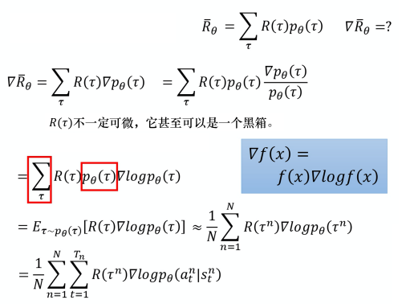
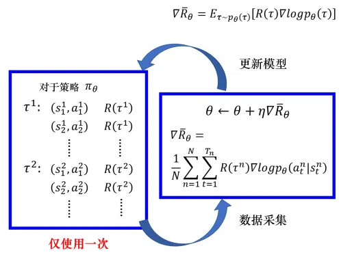

# 策略梯度（pg）

## 0.引言

根据智能体学习的不同，可将其分为Value-based方法、Policy-based方法以及Actor-Critic方法。Q-learning、Saras和DQN都是基于价值去学习，虽然这种强化学习方法在很多领域都获得较多的应用，但是它的局限性也是比较明显。首先这类算法基本上都是**处理离散动作**，建立简单的Q表，很难对连续动作进行处理，更无法建立庞大的Q表；其次**基于价值的方法使用值函数去近似Q值**，虽然可以较高效率地解决连续状态空间的问题，但动作依然只是离散的，动作选择的策略也是不会变化的，通常是一个确定性的策略，但有些实际问题需要的最优策略并不是确定性的，而是随机策略，比如石头剪刀布，如果按照一种确定性策略出拳，那么当别人抓住规律时，你就会输。所以需要引入一个新的方法去解决以上问题，比如策略梯度的方法。

## 1. 蒙特卡罗

在讲解策略梯度算法（Policy Gradient，简称PG）前，可以先了解一下蒙特卡罗算法，首先来看一个小故事：

在火影时代，还是下忍的鸣人为了提升自己的能力，从木叶忍者任务中心接了一个C级任务，在做任务的时候，突然被一个戴面具的人困在幻境中。类似迷宫的幻境（出口是光之门，可以理解为带光的门），鸣人怎么走都出不去，这个幻境虽然有很多出口，但只有最近的出口通过光之门才能走出幻境，其他的出口虽然有光之门，但是过不去。有可能鸣人对数学方面也颇有造诣，他用自己学习的禁术多重影分身之术，分出很多个分身（假设足够多，不要问作为下忍的鸣人查克拉够不够，在危急时刻，他可以向体内的九尾借啊），然后开始对每一个分身交代任务：

注意: 分身都从起点出发，每走一步，都会得到相应的查克拉补充或降低能量（奖励，有正有负）。且每一个分身面对分叉路口的选择都是平均选择。忽略奖励的折扣因子。

1.  你们每个人都需要找到一个出口，不论远近，且途中每走一步都需要将自己所经过的路径和得到查克拉的多少记录到卷轴上；
2.  记录走过的这条路径获得的总查克拉，原路返回到出发点；
3.  将你们每个人得到的总奖励进行平均，最终结果汇报给我，作为当前出发点的值。
4.  然后将出发点换成下一步可以选择的出发地，重复1\~3。

鸣人拿到所有路口的值后，每遇到一个分叉路口就选择值最大的那个路口，最终鸣人成功的走出了幻境。

上面的故事其实是类似蒙特卡罗算法，具体如下；

蒙特卡罗算法是基于采样的方法，**给定策略**$π$**，让智能体与环境进行交互，就会得到很多条轨迹。 每条轨迹都有对应的回报，把每条轨迹的回报进行平均，就可以知道某一个策略下面对应状态的价值**。这句话拆分开来可以对应上述故事：

1.  蒙特卡罗是基于采样的方法。（对应故事中鸣人的分身足够多）
2.  需要给定一个策略π（对应故事中每个分身遇到分叉路口都是平均选择）
3.  智能体与环境进行交互，得到很多轨迹。（对应故事中每一个分身在幻境中找出口的过程，每个分身对应一条轨迹）
4.  每条轨迹都有对应的回报。（对应故事中每个分身得到的总奖励）
5.  将每条轨迹的回报进行平均，就得到对应状态的价值了。（对应鸣人将每个分身的总奖励进行平均）

## 2. 策略梯度算法

### 2.1 简介

在强化学习中，有三个组成部分：**演员（actor）**、**环境**和**奖励函数**。其中环境和奖励函数不是我们可以控制的，在开始学习之前就已经事先给定。演员里会有一个策略，它用来决定演员的动作。策略就是给定一个外界输入，它会输出演员现在应该要执行的动作。唯一可以做的就是调整演员里面的策略，使得演员可以得到最大的奖励。

将深度学习与强化学习相结合时，策略$π$就是一个网络，用$θ$表示$π$的参数。举上面幻境的例子，输入就是当前分身所在的分叉路口，假设可以向上，向下，向左走，经过策略网络后，输出就是三个动作可以选择的概率。然后演员就根据这个概率的分布来决定它要采取的动作，概率分布不同，演员采取的动作也不同。简单来说，策略的网络输出是一个概率分布，演员根据这个分布去做采样，决定实际上要采取的动作是哪一个。

其实**PG就是蒙特卡罗与神经网络结合的算法**，PG不再像Q-learning、DQN一样输出Q值，而是在一个连续区间内直接输出当前状态可以采用所有动作的概率。

在基于价值的方法中，使用**价值函数近似将Q表更新问题变成一个函数拟合问题**，相近的状态得到相近的输出动作，如下式，**通过更新参数**\*\*`w`****使得函数****`f`\*\***逼近最优Q值**。

$$
Q(s,a)≈f(s,a,w)
$$

在PG算法中，因为策略是一个概率，不能直接用来迭代，所以采取类似的思路，将其转化为函数形式，如下式所示，这时的目的则是**使用带有**$θ$**参数的函数对策略进行近似，通过更新参数**$θ$**，逼近最优策略**。

$$
\pi(a \mid s) \approx \pi \theta(s, a)=P(a \mid s, \theta)
$$

现在有了策略函数，目标当然是优化它，那么该如何知道优化后的策略函数的优劣呢。大家肯定会想到需要一个可以优化的目标函数，我让这个目标函数朝着最大值的方向去优化，它的主要作用就是用来衡量策略的好坏程度。

### 2.2 算法内容

首先，可以把环境看成一个函数，这个函数一开始就先吐出一个状态，假如这个状态是游戏的画面，接下来演员看到这个游戏画面 $s_1$以后，选择了$a_1$这个动作。环境把$a_1$当作它的输入，再吐出$s_2$，也就是吐出新的游戏画面。演员看到新的游戏画面，再采取新的动作$a_2$。环境再看$a_2$，再吐出$s_3$。这个过程会一直持续到环境觉得应该要停止为止。

在一场游戏中，演员通过与环境的不断交互最终结束，根据上述的说明，可以得到一条轨迹，表示为$τ$，其中$s$表示状态，$a$表示行动，$s_1$，$a_1$表示演员在状态1的时候选择了动作1，后面的以此类推。如下式所示。

$$
\tau=\left\{s_{1}, a_{1}, s_{2}, a_{2}, \cdots, s_{t}, a_{t}\right\}
$$

那么假设当前演员的策略网络参数是$θ$，就可以计算这一条轨迹发生的概率。它取决于两部分，**环境的动作和智能体的动作**，如下式所示，它就表示一条轨迹产生后所发生的概率。

$$
\begin{aligned} p_{\theta}(\tau) & =p\left(s_{1}\right) p_{\theta}\left(a_{1} \mid s_{1}\right) p\left(s_{2} \mid s_{1}, a_{1}\right) p_{\theta}\left(a_{2} \mid s_{2}\right) p\left(s_{3} \mid s_{2}, a_{2}\right) \ldots \\ & =p\left(s_{1}\right) \prod_{t=1}^{T} p_{\theta}\left(a_{t} \mid s_{t}\right) p\left(s_{t+1} \mid s_{t}, a_{t}\right)\end{aligned}
$$

环境的动作是指环境的函数内部的参数或内部的规则长什么样子，它是无法控制的，提前已经写好，$p(s_{t+1}∣s_t,a_t)$ 代表环境。智能体的动作是指能够自己控制，$p_θ(a_t∣s_t)$代表智能体，给定一个状态$s_t$，演员要采取什么样的动作$a_t$会取决于演员的参数$θ$，所以这部分是演员可以自己控制的。随着演员的动作不同，每个同样的轨迹，它就会有不同的出现的概率。

除了环境跟演员以外，还有奖励函数。给它输入$s_1$，$a_1$，它告诉你得到$r_1$。给它 $s_2$，$a_2$，它告诉你得到$r_2$。把所有的$r$都加起来，就得到了$R(τ)$，代表某一个轨迹$τ$的奖励。

在某一场游戏里面，**会得到**$R$**。通过调整演员内部的参数**$θ$**， 使得**$R$**的值越大越好，这就是PG算法的优化目标**。但实际上奖励并不只是一个标量，奖励$R$是一个随机变量，因为演员在给定同样的状态会做什么样的动作，是具有随机性的。环境在给定同样的观测要采取什么样的动作，要产生什么样的观测，本身也是有随机性的，所以$R$是一个随机变量。那么就可以计算，在给定某一组参数$θ$的情况下，得到的$R_θ$的期望值是多少。期望值如下公式所示。

$$
\bar{R}_{\theta}=\sum_{\tau} R(\tau) p_{\theta}(\tau)=E_{\tau \sim p_{\theta}(\tau)}[R(\tau)]
$$

需要穷举所有可能的轨迹$τ$，**每一个轨迹**$τ$**都有一个概率和一个总奖励**$R$**。也可以从分布**$p_θ(τ)$**采样一个轨迹**$τ$**，计算**$R(τ)$**的期望值**，就是期望奖励。要做的事情就是**最大化期望奖励**。

如何最大化期望奖励呢，既然是最大化，那么**可以采用梯度上升的方式更新参数**，使得期望奖励最大化。对$\bar{R}$取梯度，这里面只有$p_θ(τ)$是跟$θ$有关。整个策略梯度公式如下图所示。



> 图1. 策略梯度公式

其中，对$∇p_θ(τ)$使用$∇f(x)=f(x)∇log⁡f(x)$，得到

$$
∇p_θ(τ)=p_θ(τ)∇log⁡~p_θ(τ)
$$

这个$∇f(x)=f(x)∇log⁡f(x)$大家可以把这个理解成一个固定的公式转换，记住即可。

如下式所示，对$τ$进行求和，把$R(τ)$和$log⁡p_θ(τ)$这两项使用$p_θ(τ)$进行加权，既然使用$p_θ(τ)$进行加权，它们就可以被写成期望的形式。也就是从$p_θ(τ)$这个分布里面采样$τ$出来，去计算$R(τ)$乘上$log⁡p_θ(τ)$，把它对所有可能的$τ$进行求和，就是这个期望的值。

$$
\begin{aligned} \nabla \bar{R}_{\theta} & =\sum_{\tau} R(\tau) \nabla p_{\theta}(\tau) \\ & =\sum_{\tau} R(\tau) p_{\theta}(\tau) \frac{\nabla p_{\theta}(\tau)}{p_{\theta}(\tau)} \\ & =\sum_{\tau} R(\tau) p_{\theta}(\tau) \nabla \log p_{\theta}(\tau) \\ & =E_{\tau \sim p_{\theta}(\tau)}\left[R(\tau) \nabla \log p_{\theta}(\tau)\right]\end{aligned}
$$

实际上这个期望值没有办法算，所以是用采样的方式来采样$N$条轨迹$τ$，去计算每一条的这些值，把它全部加起来，就可以得到梯度。就可以去更新参数，就可以去更新智能体，如下式所示。

$$
\begin{aligned} E_{\tau \sim p_{\theta}(\tau)}\left[R(\tau) \nabla \log p_{\theta}(\tau)\right] & \approx \frac{1}{N} \sum_{n=1}^{N} R\left(\tau^{n}\right) \nabla \log p_{\theta}\left(\tau^{n}\right) \\ & =\frac{1}{N} \sum_{n=1}^{N} \sum_{t=1}^{T_{n}} R\left(\tau^{n}\right) \nabla \log p_{\theta}\left(a_{t}^{n} \mid s_{t}^{n}\right)\end{aligned}
$$

$∇log⁡p_θ(τ)$ 的具体计算过程，如下式所示

$$
\begin{aligned} \nabla \log p_{\theta}(\tau) & =\nabla\left(\log p\left(s_{1}\right)+\sum_{t=1}^{T} \log p_{\theta}\left(a_{t} \mid s_{t}\right)+\sum_{t=1}^{T} \log p\left(s_{t+1} \mid s_{t}, a_{t}\right)\right) \\ & =\nabla \log p\left(s_{1}\right)+\nabla \sum_{t=1}^{T} \log p_{\theta}\left(a_{t} \mid s_{t}\right)+\nabla \sum_{t=1}^{T} \log p\left(s_{t+1} \mid s_{t}, a_{t}\right) \\ & =\nabla \sum_{t=1}^{T} \log p_{\theta}\left(a_{t} \mid s_{t}\right) \\ & =\sum_{t=1}^{T} \nabla \log p_{\theta}\left(a_{t} \mid s_{t}\right)\end{aligned}
$$

注意，$p(s_1)$和$p(s_{t+1}∣s_t,a_t)$来自于环境，$p_θ(a_t∣s_t)$是来自于智能体。$p(s_1)$和$p(s_{t+1}∣s_t,a_t)$由环境决定，所以与$θ$无关，因此

$$
\begin{array}{c}\nabla \log p\left(s_{1}\right)=0 \\ \nabla \sum_{t=1}^{T} \log p\left(s_{t+1} \mid s_{t}, a_{t}\right)=0\end{array}
$$

可以直观地来理解图1最终推导出来的公式，也就是在采样到的数据里面，采样到在某一个状态$s_t$要执行某一 个动作$a_t$，$s_t$和$a_t$它是在整个轨迹$τ$的里面的某一个状态和动作的对。 **假设在**$s_t$**执行**$a_t$**，最后发现**$τ$**的奖励是正的，就要增加这一项的概率，就要增加在**$s_t$**执行**$a_t$**的概率。反之，在**$s_t$**执行**$a_t$**会导致**$τ$\*\* 的奖励变成负的，就要减少这一项的概率。\*\* ​

要计算上式，首先要先收集一大堆的`s`跟`a`的对（pair），还要知道这些`s`跟`a`在跟环境互动的时候，会得到多少的奖励。具体要拿智能体，它的参数是$θ$，去跟环境做互动，互动完以后，就会得到一大堆游戏的纪录。

就可以把采样到的数据代到梯度公式里面，把梯度算出来。也就是把采样到的数据中的每一个`s`跟`a`的对拿进来，算一下它的对数概率，也就是计算在某一个状态采取某一个动作的对数概率，对它取梯度，这个梯度前面会乘一个权重，权重就是这场游戏的奖励。有了这些以后，就会去更新模型。



> 图2. 策略梯度算法

更新完模型以后，要重新去收集数据再更新模型。注意，一般策略梯度采样的数据就只会用一次。把这些数据采样起来，然后拿去更新参数，这些数据就丢掉了。接着再重新采样数据，才能够去更新参数。不过这也是有解决方法的，接下来会介绍如何解决。

### 2.3 技巧

#### （1）增加基线

在很多游戏中，得到的奖励总是正的，或者说最低也就是0。由于采取行动的概率和为1，当所有的reward都为正的时候，可能存在进行归一化后，R（权重）大的上升的多，R小的，归一化后它就是下降的。比如下面这种情况，假设某一状态下有三个动作，分别是a,b,c，奖励都是正的。根据公式$\nabla \bar{R}_{\theta}$，希望将这三个动作的概率以及对数概率都拉高，但是它们前面的权重R不一样，有大有小，所以权重大的，上升的多一点；权重小的，上升的少一些，又因为对数概率是一个概率，三个动作的和要为0，那么在做完归一化后，上升多的才会上升，上升的少的就是下降的。


> 图3. 添加基线

采样应该是一个期望，对所有可能的`s`跟`a`的对进行求和。但真正在学习时，只是采样了少量的`s`跟`a`的对而已。有一些动作可能从来都没有采样到。同样假设在某一个状态可以执行的动作有a,b,c，但你可能只采样到动作`b`或者只采样到动作`c`，没有采样到动作`a`。 现在所有动作的奖励都是正的，根据公式$\nabla \bar{R}_{\theta}$，它的每一项概率都应上升。因为`a`没有被采样到，其它动作的概率如果都要上升，`a`的概率就下降。但`a`不一定是一个不好的动作，它只是没被采样到。但概率却下降了，这显然是有问题的，所以**希望奖励不要总是正的**。

为了解决奖励总是正的这一问题，可以把奖励减掉一项`b`，如下式所示。

$$
\nabla \bar{R}_{\theta} \approx \frac{1}{N} \sum_{n=1}^{N} \sum_{t=1}^{T_{n}}\left(R\left(\tau^{n}\right)-b\right) \nabla \log p_{\theta}\left(a_{t}^{n} \mid s_{t}^{n}\right)
$$

其中，`b`叫做基线，减掉`b`以后，就可以让$R(τn)−b$这一项有正有负。所以如果得到的总奖励$R(τn)$大于`b`的话，就让它的概率上升。如果这个总奖励小于`b`，就算它是正的，正的很小也是不好的，就要让这一项的概率下降。`b`通常是把$τn$的值取期望，算一下$τn$的平均值，即$b≈E[R(τ)]$。在实际训练的时候，不断地把$R(τn)$的分数记录下来，不断地计算$R(τn)$的平均值当作`b`。

#### （2）分配合适的分数

在同一场游戏或者同一个回合中，**所有的状态跟动作的对都会使用同样的奖励项进行加权，这不公平，因为在同一场游戏中也许有些动作是好的，有些动作是不好的**。假设整场游戏的结果是好的，但不代表每一个动作都是对的，反之，也是。举个例子，假设游戏很短，在s1执行a1的奖励r1是5，在s2执行a2的奖励r2是0，在s3执行a3的奖励r3是-2。整场游戏结束，总奖励为3。但不代表在s2执行动作a2是好的，因为这个正的分数，主要来自于在s1执行了a1， 跟在s2执行a2是没有关系的，也许在s2执行a2反而是不好的，因为它导致你接下来会进入s3，执行s3被扣分，所以整场游戏得到的结果是好的，并不代表每一个动作都是对的。因此在训练的时候，每一个状态跟动作的对，都会被乘上3。

在理想的状况下，这个问题，**如果采样够多是可以被解决的**。但现在的问题是采样的次数不够多，所以计算这个`状态-动作`对的奖励的时候，不把整场游戏得到的奖励全部加起来，只计算从这个动作执行以后所得到的奖励。因为这场游戏在执行这个动作之前发生的事情是跟执行这个动作是没有关系的，所以在执行这个动作之前得到多少奖励都不能算是这个动作的功劳。跟这个动作有关的东西，只有在执行这个动作以后发生的所有的奖励把它加起来，才是这个动作真正的贡献。如下式。

$$
\nabla \bar{R}_{\theta} \approx \frac{1}{N} \sum_{n=1}^{N} \sum_{t=1}^{T_{n}}\left(\sum_{t^{\prime}=t}^{T_{n}} \gamma^{t^{\prime}-t} r_{t^{\prime}}^{n}-b\right) \nabla \log p_{\theta}\left(a_{t}^{n} \mid s_{t}^{n}\right)
$$

对未来的奖励做了一个折扣，因为时间越久，奖励的重要性就越小，折扣因子$γ$，$γ∈[0,1]$，一般设置为0.9或0.99，如果$γ=0$，这表示只关心即时奖励；如果 $γ=1$， 这表示未来奖励等同于即时奖励。

举个例子大家就明白了，比如现在给你100块钱，和过个10年再把这个100块钱给你，你愿意选择哪一个，当然是前者啦，10年后的100块钱，有可能就相当于现在的10块钱的价值了。换句话说，60年代的1块钱和现在的1块钱的价值是一样的吗？

## 3.代码实现

案例：模拟登月小艇降落在月球表面时的情形。任务的目标是让登月小艇安全地降落在两个黄色旗帜间的平地上。测试环境：LunarLander-v2

-   `Obs`：这个游戏环境有八个观测值，分别是水平坐标x，垂直坐标y，水平速度，垂直速度，角度，角速度，腿1触地，腿2触地；
-   `Action`：agent可以采取四种离散行动，分别是什么都不做，发动左方向引擎喷射，发动主引擎向下喷射，发动右方向引擎喷射。
-   `Reward`：小艇坠毁得-100分；小艇成功着陆在两个黄色旗帜之间得100\~140分；喷射主引擎向下喷火每次得-0.3分；小艇最终完全静止则再得100分；每条腿着地各得10分。

这里虽然采用的是离散的动作空间，但是整体代码是相差不大的，感兴趣的同学可以尝试下连续的动作空间。

定义网络结构：

```python
class PolicyNet(nn.Module):
    def __init__(self, n_states_num, n_actions_num, hidden_size):
        super(PolicyNet, self).__init__()
        self.data = []  # 存储轨迹
        # 输入为长度为8的向量 输出为4个动作
        self.net = nn.Sequential(
            # 两个线性层，中间使用Relu激活函数连接，最后连接softmax输出每个动作的概率
            nn.Linear(in_features=n_states_num, out_features=hidden_size, bias=False),
            nn.ReLU(),
            nn.Linear(in_features=hidden_size, out_features=n_actions_num, bias=False),
            nn.Softmax(dim=1)
        )

    def forward(self, inputs):
        # 状态输入s的shape为向量：[8]
        x = self.net(inputs)
        return x


```

定义PG类：

```python
class PolicyGradient():

    def __init__(self, n_states_num, n_actions_num, learning_rate=0.01, reward_decay=0.95 ):
        # 状态数   state是一个8维向量，分别是水平坐标x,垂直坐标y,水平速度,垂直速度,角度,角速度,腿1触地,腿2触地
        self.n_states_num = n_states_num
        # action是4维、离散，即什么都不做，发动左方向引擎，发动主机，发动右方向引擎。
        self.n_actions_num = n_actions_num
        # 学习率
        self.lr = learning_rate
        # gamma
        self.gamma = reward_decay
        # 网络
        self.pi = PolicyNet(n_states_num, n_actions_num, 128)
        # 优化器
        self.optimizer = torch.optim.Adam(self.pi.parameters(), lr=learning_rate)
        # 存储轨迹  存储方式为  （每一次的reward，动作的概率）
        self.data = []
        self.cost_his = []

    # 存储轨迹数据
    def put_data(self, item):
        # 记录r,log_P(a|s)z
        self.data.append(item)

    def train_net(self):
        # 计算梯度并更新策略网络参数。tape为梯度记录器
        R = 0  # 终结状态的初始回报为0
        policy_loss = []
        for r, log_prob in self.data[::-1]:  # 逆序取
            R = r + gamma * R  # 计算每个时间戳上的回报
            # 每个时间戳都计算一次梯度
            loss = -log_prob * R
            policy_loss.append(loss)
        self.optimizer.zero_grad()
        policy_loss = torch.cat(policy_loss).sum()  # 求和
        # print('policy_loss:', policy_loss.item())
        # 反向传播
        policy_loss.backward()
        self.optimizer.step()
        self.cost_his.append(policy_loss.item())
        # print('cost_his:', self.cost_his)
        self.data = []  # 清空轨迹

    # 将状态传入神经网络 根据概率选择动作
    def choose_action(self, state):
        # 将state转化成tensor 并且维度转化为[8]->[1,8]  
        s = torch.Tensor(state).unsqueeze(0)
        prob = self.pi(s)  # 动作分布:[0,1,2,3]
        # 从类别分布中采样1个动作, shape: [1] torch.log(prob), 1
        
        # 作用是创建以参数prob为标准的类别分布，样本是来自“0 … K-1”的整数，其中K是prob参数的长度。也就是说，按照传入的prob中给定的概率，
        # 在相应的位置处进行取样，取样返回的是该位置的整数索引。不是最大的，是按照概率采样的那个，采样到那个就是哪个的索引
        m = torch.distributions.Categorical(prob)  # 生成分布
        action = m.sample()
        return action.item(), m.log_prob(action)
        
    def plot_cost(self, avage_reward):
        import matplotlib.pyplot as plt
        plt.plot(np.arange(len(avage_reward)), avage_reward)
        plt.ylabel('Reward')
        plt.xlabel('training steps')
        plt.show()


```

训练模型：

```python
import   gym,os
import  numpy as np
import  matplotlib
# Default parameters for plots
matplotlib.rcParams['font.size'] = 18
matplotlib.rcParams['figure.titlesize'] = 18
matplotlib.rcParams['figure.figsize'] = [9, 7]
matplotlib.rcParams['font.family'] = ['KaiTi']
matplotlib.rcParams['axes.unicode_minus']=False

import torch
from torch import nn
env = gym.make('CartPole-v1')
env.seed(2333)
torch.manual_seed(2333)    # 策略梯度算法方差很大，设置seed以保证复现性
print('observation space:',env.observation_space)
print('action space:',env.action_space)

learning_rate = 0.0002
gamma         = 0.98

def main():
    policyGradient = PolicyGradient(4,2)
    running_reward = 10  # 计分
    print_interval = 20  # 打印间隔
    for n_epi in range(1000):
        state = env.reset()  # 回到游戏初始状态，返回s0
        ep_reward = 0
        for t in range(1001):  # CartPole-v1 forced to terminates at 1000 step.
            #根据状态 传入神经网络 选择动作
            action ,log_prob  = policyGradient.choose_action2(state)
            #与环境交互
            s_prime, reward, done, info = env.step(action)
            # s_prime, reward, done, info = env.step(action)
            if n_epi > 1000:
                env.render()
            # 记录动作a和动作产生的奖励r
            # prob shape:[1,2]
            policyGradient.put_data((reward, log_prob))
            state = s_prime  # 刷新状态
            ep_reward += reward
            if done:  # 当前episode终止
                break
            # episode终止后，训练一次网络
        running_reward = 0.05 * ep_reward + (1 - 0.05) * running_reward
        #交互完成后 进行学习
        policyGradient.train_net()
        if n_epi % print_interval == 0:
            print('Episode {}\tLast reward: {:.2f}\tAverage reward: {:.2f}'.format(
                n_epi, ep_reward, running_reward))
        if running_reward > env.spec.reward_threshold:  # 大于游戏的最大阈值475时，退出游戏
            print("Solved! Running reward is now {} and "
                  "the last episode runs to {} time steps!".format(running_reward, t))
            break
    policyGradient.plot_cost()

```

## 4.总结

策略梯度可以很好的解决具有连续动作空间的场景，可以学习到一些随机策略，有时是最优策略。可能还会有较好的收敛性，但也有可能收敛到局部最优，而不是全局最优，评价策略的过程有时也会比较低效，方差很大。不过总体还是不错的，之后我们再介绍相对更好的算法来解决这些缺点。

## 5.参考文献

\[1]《Reinforcement+Learning: An+Introduction》

\[2] [https://blog.csdn.net/baidu\_41871794/article/details/111057371](https://blog.csdn.net/baidu_41871794/article/details/111057371 "https://blog.csdn.net/baidu_41871794/article/details/111057371")
